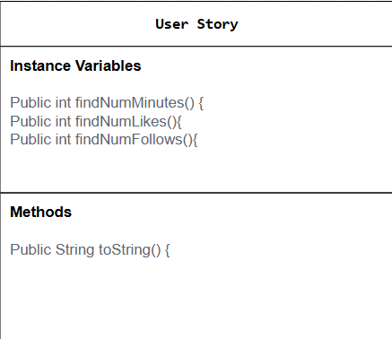

# Data-for-social-good# Unit 3 - Data for Social Good Project 

## Introduction 

Software engineers develop programs to work with data and provide information to a user. Each user has different needs based on the information they are looking for from data. Your goal is to create a data analysis program for your user that stores and analyzes data to provide the information they need. 

## Requirements 

Use your knowledge of object-oriented programming, one-dimensional (1D) arrays, and algorithms to create your data analysis program: 
- **Write a class** – Write a class to represent your user or business and store and analyze their data with no-argument and parameterized constructors. 
- **Create at least two 1D arrays** – Create at least two 1D arrays to store the data that your user needs information about. 
- **Write a method** – Write a method that finds or manipulates the elements in a 1D array to provide the information your user needs. 
- **Implement a toString() method** – Write a toString() method that returns general information about the data (for example, number of values in the dataset). 
- **Document your code** – Use comments to explain the purpose of the methods and code segments and note any preconditions and postconditions. 

## User Story 

> As an [influencer],   
> I want to [find which social media platform is best to use in order to get the most likes and follows],   
> so that I can [become a famous influencer]. 

## Dataset 

Dataset: https://www.kaggle.com/datasets/bhadramohit/social-media-usage-datasetapplications
- **App** (String) - name of the app
- **Daily Minutes** (int) - number of minutes spent by each user
- **Likes per day** (int) - number of likes each user leaves on each app
- **Follows per day** (int) - number of follows each user gets per day

## UML Diagram 

 

## Description 

For my user story, I chose to do an influencer. Their goal was to figure out what social media platform was the best in order to get a lot of views and likes. The questions the user had was which app had the most screen time and which app got the most followers, I used these questions to plan my code and choose a dataset. The dataset I chose went off of different users and how many minutes they spent on each app, how many likes, and how many followers they gained each day. For the code, I created an instance variable that found which text file had the greatest numbers corresponding with each app so that in the console it printed out which app answered the users question. In the data runner I created a parameterized constructor in order for the array to have a length and was able to print out the app Pintrest with the amount of follows, likes, and minutes each day. The toString method checks the length of the 1D array and if it is zero it sends out "No data available.".